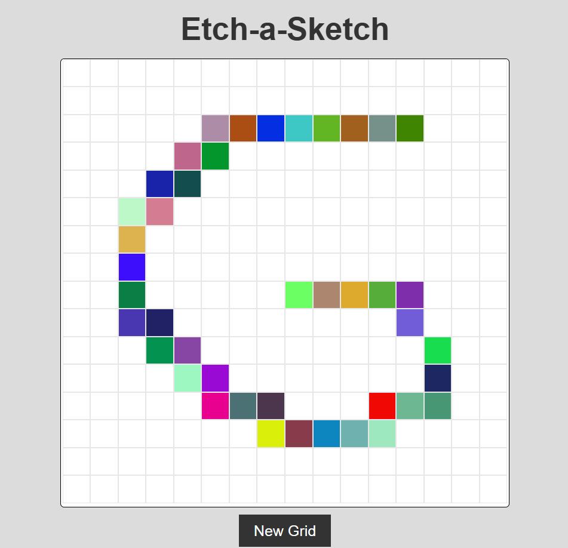

# Etch-a-Sketch Project

This is an **Etch-a-Sketch** project created as part of [The Odin Project](https://www.theodinproject.com/) Foundations curriculum. The project focuses on JavaScript DOM manipulation to build a functional and interactive drawing grid.

## Features

- A customizable grid where users can draw by hovering over squares.
- Adjustable grid size via user input.
- Random colors for each hover.
- Clear button to reset the grid and start fresh.
- Simple and responsive design for usability on different devices.

## Project Preview

 

Try the live version of the project here: [Live Preview](https://gonalgar.github.io/etch-a-sketch/)

## Technologies Used

- **HTML5**: Markup for the structure of the page.
- **CSS3**: Styling for the layout, grid, and interactive features.
- **JavaScript**: Logic for grid creation, event handling, and dynamic styling.

## Getting Started

To view or modify the project locally:

1. Clone this repository:
   ```bash
   git clone https://github.com/your-username/etch-a-sketch.git
2. Navigate to the project directory:
    ```bash
    cd etch-a-sketch
3. Open the index.html file in your browser to view and interact with the Etch-a-Sketch.

## What I Learned
Through this project, I practiced:

- Dynamically creating and modifying elements in the DOM.
- Handling user inputs and events to adjust application behavior.
- Implementing grid-based layouts with CSS.
- Managing state and adding interactivity with JavaScript.

## Acknowledgements
This project is part of [The Odin Project](https://www.theodinproject.com/paths/foundations/courses/foundations) Foundations curriculum. It provided an excellent introduction to DOM manipulation and interactive webpage development.

## License
This project is open-source and available under the MIT License.